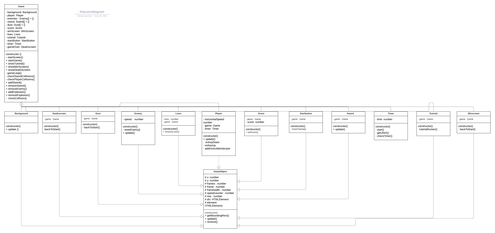

# PRG04 opdracht 

Object Oriented Game Design in Typescript - inleveropdracht

## Deadline: Week 9 - 30 juni - 10:00 uur

Voor dit vak werk je wekelijks aan je typescript game. Deze reposistory bevat je wekelijkse updates. **Let op de deadline! Hierna kan je geen werk meer inleveren**

Je werk wordt beoordeeld volgens de cursushandleiding. Je krijgt punten voor onderstaande criteria, door elk punt individueel te *beschrijven in dit inleverdocument* én *toe te passen in je code*.

---

 
 
 

<!-- ## Gameplay

Toelichting gameplay

## Classes

Toelichting classes -->

## Encapsulation

Elke class heeft zijn eigen private properties. Sommige objecten hebben wel public functies, die ik in mijn gameclass roep. Maar de functies die in de objecten staan, maar niet opgeroepen worden in de gameclass, zijn private. De gameobject bevat wel protected properties, want die roep ik in elke class aan. 

Ik heb in de GameObject een getter gebruikt (getBoundingRect() )om een de rectangle op te halen. Deze informatie return ik dan, zodat ik bij player, enemy en zwaard de rectangle heb. En dan met checkCollison kan kijken als er een collision is. 
 
## Composition

Toelichting composition
Mijn game class heeft elke object, zoals je hier kan zien

 

 

## Inheritance

Toelichting inheritance

Al mijn classes behalve ‘timer’ hebben als parent de GameObject. De properties en functie die ik in het gameobject, gebruik in alle classes. Bijvoorbeeld om een tag te maken of voor een rectangle optehalen voor een bepaald object. Hiermee inherit ik in bijna alle bestande de properties en functies van het gameobject

## Game development techieken

Toelichting Game development techieken

<strong>HTML</strong>
 

Ik heb een simpel html file met een basis opstel en een verwijzing naar de game.js
Ook heb ik een verwijzing naar mijn style.css, waarbij ik al mijn css regel

<strong>CSS</strong>
 

In mijn css bestand heb ik de tags die gemaakt heb in typescript gestyled voor de tekst, buttons en sprites

<strong>Gameloop</strong>
 

Ik heb in mijn gameloop in de game.ts een loop gemaakt meerdere om alle enemies, zwaarden en explosies te maken. Daarnaast heb ik de requestAnimation frame gezet zodat alles 60x per seconden gezet. Ik heb ook een cancelAnimationframe gebruikt, zodat de requestAnimationframe gestopt wordt, waardoor alles wordt overlapt.

Ik heb de getRectangle functie gemaakt in het gameObject. Hiermee haal ik de 8 properties 

<li>Left</li>
<li>Top</li>
<li>Right</li>
<li>Bottom</li>
<li>X</li>
<li>Y</li>
<li>Width</li>
<li>Height</li>
 
<strong>Collison</strong>
 

 Daarnaast heb ik de checkCollision functie, waarbij ik de berekening doe tussen 2 clientrect (a en b). 
Dan heb ik de functies checkPlayerCollisions en checkSwordCollisions. Hierbij voer ik de checkCollision als er een collision is tussen de getRectangle van 2 divs 

<strong>Besturing</strong>
 
De besturing is alleen voor de player. Ik heb hierbij op de keyDown een parameter e: KeyboardEvent gegeven. Ik heb dan een switch gebruikt om verschillende cases te kunnen gebruiken.  
<li>Pijltje naar links: Naar links lopen</li>
<li>Pijtje naar rechts: Naar rechts lopen</li>
<li>Spatiebalk: Slaan</li>
 

<strong>Timer</strong>

Ik heb een timer gebruikt om te checken voor true en false. Ik heb dit gedaan door met unix timestamp te werken. Als de speler wordt geraakt, word de speler invincible voor 3 seconden en word de functie false. Na de 3 seconden wordt de functie weer true en kan de speler weer worden geraakt.

<strong>Object Pooling</strong>

 De object pooling heb ik voor de enemy, dust en zwaard. Ik loop in de gameloop over elke object heen. In de game.ts heb ik ook voor de objecten een remove functie, die ik van de gameobject functie "remove" gebruik om een de div te removen, Dit gebruik ik als de speler de level heeft behaald en terug gaat naar de homepagina   

<!-- ## Finishing touch
 
Toelichting finishing touch  -->
